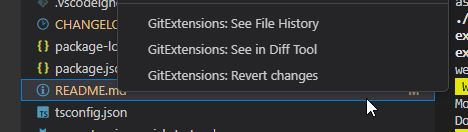

# Visual Studio Code extension for GitExtensions

This is the [Visual Studio Code](https://code.visualstudio.com/) extension to use [Git Extensions](http://gitextensions.github.io/) (on [GitHub](https://github.com/gitextensions/gitextensions)).

## Features

Commands available via the Command Palette:

* GitExtensions: Blame current file
* GitExtensions: Create a branch
* GitExtensions: Browse repository
* GitExtensions: Commit
* GitExtensions: Checkout a branch
* GitExtensions: Checkout a revision
* GitExtensions: See in Diff Tool
* GitExtensions: See File History
* GitExtensions: Init a repository
* GitExtensions: Resolve merge in GitExtensions
* GitExtensions: Pull commits
* GitExtensions: Push commits
* GitExtensions: Reset changes
* GitExtensions: Open settings
* GitExtensions: Manage stashs
* GitExtensions: Synchronize (Commit / Pull / Push)
* GitExtensions: Create a tag
* GitExtensions: Manage remotes

Commands in command palette:

Commands available via the icons in the Status Bar (see VSCode settings to hide them):

* GitExtensions: Browse repository
* GitExtensions: See File History

Icons in the status bar:

Commands available via the `explorer`, the `editor` and the `editor title` contextual menus :

* GitExtensions: See in Diff Tool
* GitExtensions: See File History
* GitExtensions: Revert changes

Commands in the explorer:

Commands in the editor:

Commands available via the `Source Control Management` title menu :
* GitExtensions: Browse repository
* GitExtensions: Commit

Commands in the SCM menu:

These contextual menus could be easily hidden with VSCode settings `config.gitExtensions.explorer.contextmenu`, `config.gitExtensions.editor.title.contextmenu`,  `config.gitExtensions.editor.contextmenu` and `gitExtensions.scm.title.menu`.

All the settings available to disable some integration:

## Requirements

* GitExtensions should be accessible in the PATH or configured in VSCode setting `gitExtensions.exe.path`.
* Visual Studio Code v1.74

## Known Issues

None at the moment (it's a work in progress)

